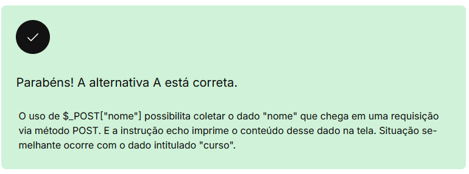

# ambiente web, client X servidor e suas tecnologias

O modelo cliente X servidor foi criado pela Xerox PARC nos anos 1970, tendo como principal premissa a separação entre dados e recursos de processamento, ao contrário do modelo predominante à época — conhecido como modelo centralizado, em que tanto o armazenamento dos dados quanto o seu processamento ficavam a cargo dos computadores de grande porte: mainframe.

## modelo de duas camadas

apenas camada cliente e servidor,

- cliente trata logica e interface com o usuario
- servidor trata os dados
- sistemas gerenciadores de bancos de dados (SGDB)

dentro dele temos 3 tipos de camadas

1. camada de apresentação
   instalada na maquina do cliente, responsavel pela interface e comunicação com o usuario
2. camada de aplicação
   um servidor responsavel pela lógica e pelas regras de negocio, e controle de acesso ao servidor de dados
3. camada de dados
   o servidor responsavel pelo armazenamento de dados

# ambiente web

http = hypertext transfer protocol

# design responsivo

O conceito de design responsivo teve sua origem no projeto arquitetônico responsivo. Tal projeto prega que uma sala ou um espaço deve se ajustar automaticamente ao número e fluxo de pessoas dentro dele. Para tanto, é utilizada uma combinação de robótica e tecnologia, como: sensores de movimento; sistemas de controle climático com ajuste de temperatura e iluminação; juntamente com materiais — estruturas que dobram, flexionam e expandem.

layout fixo x responsivo

- media queries
- layout fluido
- scripts

valores flexiveis

- EM = Unidade de medida tipográfica, estando relacionada à letra “M”. O tamanho base dessa unidade equivale à largura da letra “M” em maiúscula.
- REM = Enquanto o EM está relacionado ao tamanho do elemento de contexto (ou seja, definimos o valor EM de um elemento tomando como base o seu elemento pai), no REM definimos que o elemento de contexto, o elemento pai, será sempre a tag HTML . Daí a letra “R” nessa unidade, que faz referência à raiz (root).

design responsivo != design adaptativo

## mobile first

uma das abordagens mais utilizadas hoje é a do mobile first, onde se cria a interface visando o usuario mobile, e depois se é adaptada para os restantes

# tecnologias HTML

# tecnologias CSS

existem 4 formas de inserir CSS numa pagina

1. inline
   usando style dentro do html
2. interno
   definidos com uso das tags
3. externo
   usando arquivos como style.css
4. escopo
   Sua declaração é feita da mesma forma que na inline. Entretanto, no lugar de ser declarada no , é declarada dentro da tag à qual se quer aplicar os estilos.

existem sites q oferecem o serviço de minificação, que é diminuir o bloat de um arquivo css

## pré-processadores

- sass
- less
- styles

# javascript

Jquery = biblioteca que melhora manipulação de elementos html
Prototype = framework javascript de codigo aberto, fornece API para manipulação de DOM e ajax, prototypeJs

# Considerações finais

    Modelo cliente x servidor.
    Ambiente web.
    Conceito de interface.
    Conceito de design responsivo.
    HTML, CSS e JavaScript.
    Linguagem PHP.
    Páginas dinâmicas e acesso a dados.
